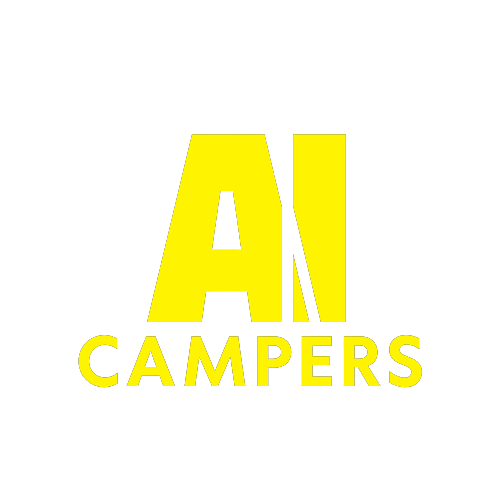
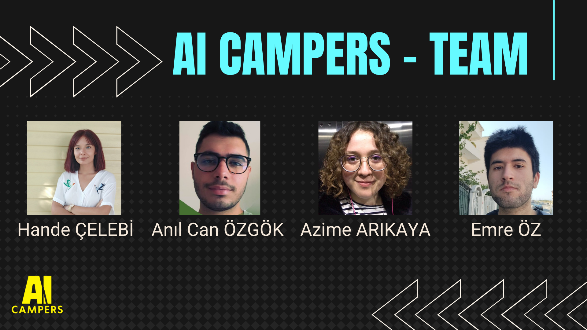

<a name="readme-top"></a>

<!-- PROJECT LOGO -->
<br />
<div align="center">
  <a>
    
  </a>

  <h3 align="center">AI CAMPERS</h3>

  <p align="center">
    AI Summer Camp '22 - Medical Cost Analysis
    
  </p>
</div>

<!-- TABLE OF CONTENTS -->
<details>
  <summary>Table of Contents</summary>
  <ol>
    <li>
      <a href="#about-the-project">About The Project</a>
      <ul>
        <li><a href="#built-with">Built With</a></li>
      </ul>
    </li>
    <li>
      <a href="#getting-started">Getting Started</a>
      <ul>
        <li><a href="#prerequisites">Prerequisites</a></li>
        <li><a href="#installation">Installation</a></li>
      </ul>
    </li>
    <li><a href="#usage">Usage</a></li>
    <li><a href="#roadmap">Roadmap</a></li>
    <li><a href="#contributing">Contributing</a></li>
    <li><a href="#license">License</a></li>
    <li><a href="#contact">Contact</a></li>
    <li><a href="#acknowledgments">Acknowledgments</a></li>
  </ol>
</details>


<!-- ABOUT THE PROJECT -->
## About The Project

  <a>
    
  </a>

Hande ÇELEBİ - [Linkedin](https://www.linkedin.com/in/hande-%C3%A7elebi-5572461b8/)

Anıl Can ÖZGÖK - [Linkedin](https://www.linkedin.com/in/an%C4%B1l-can-%C3%B6zg%C3%B6k/)

Azime ARIKAYA - [Linkedin](https://www.linkedin.com/in/azime-arikaya-69a766219/)

Emre ÖZ - [Linkedin](https://www.linkedin.com/in/emre-oz/)

 ### Project Content
 
The aim of the project is to estimate the approximate cost of a person's health insurance based on the given variables. For this purpose, we built the infrastructure of the project with python. It is because python has library support and is easy to use.


### Built With

This section contains all libraries used in the project.

* Pandas
  ```sh
  import pandas as pd
  ```
* Numpy
  ```sh
  import numpy as nm
  ``` 
* Seaborn
  ```sh
  import seaborn as sb
  ```
* Matplot
  ```sh
  import pandas as pd
  ```
* Sklearn
  ```sh
  import sklearn as sk
  ```

<!-- GETTING STARTED -->
## Getting Started

This is an example of how you may give instructions on setting up your project locally.
To get a local copy up and running follow these simple example steps.

### Prerequisites

This is an example of how to list things you need to use the software and how to install them.
* npm
  ```sh
  npm install npm@latest -g
  ```

<!-- ACKNOWLEDGMENTS -->
## Acknowledgments

Use this space to list resources you find helpful and would like to give credit to. I've included a few of my favorites to kick things off!

* [Global AI Hub](https://globalaihub.com/ai-summer-camp-22/)
* [Gülcan Öğündür](https://medium.com/@gulcanogundur/model-se%C3%A7imi-k-fold-cross-validation-4635b61f143c)
* [Yasin Güneş](https://www.linkedin.com/in/yasin-g%C3%BCne%C5%9F-3864631b5/)
* [Günel Alizada](https://www.linkedin.com/in/gunelalizada/)
* [Kaggle Data Set](https://www.kaggle.com/datasets/mirichoi0218/insurance)
